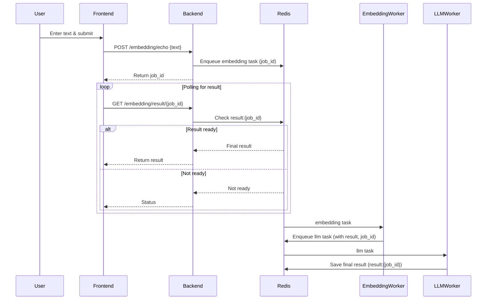

# NLP2Filters

## Asynchronous Processing: Implementation and Scalability

Asynchronous processing in this project is achieved through task queues (RQ/Redis), dedicated workers for each processing stage, polling for results by job ID, and using Redis as both a broker and a result store. This design ensures that the Flask backend is **not blocked** by long-running tasks: when a request is received, Flask immediately enqueues the task and returns a job ID, remaining free to handle other requests. The only time Flask is "blocked" is for the minimal duration required to enqueue a task or check for a result in Redis—operations that are typically very fast.

### Scalability Approaches
- **Worker Scaling:** You can run multiple instances of each worker (embedding, llm) to process more tasks in parallel, simply by starting more containers for each queue.
- **Backend Scaling:** The Flask backend can also be scaled horizontally (multiple instances behind a load balancer) since it is stateless and only interacts with Redis.
- **Queue Separation:** Each processing stage has its own queue, allowing independent scaling and monitoring.

This architecture allows the system to efficiently handle high loads and long-running tasks without degrading user experience or API responsiveness.

---

## Why Asynchronous Processing?

This project is designed to handle potentially long-running text processing tasks (such as embedding generation and LLM post-processing) in a scalable and responsive way. Asynchronous processing is used to ensure that the user interface and backend API remain fast and responsive, even when individual tasks may take several seconds or more to complete.

### Purpose of Asynchronous Architecture
- **Non-blocking user experience:** Users can submit requests and receive immediate feedback (a job ID), without waiting for the entire processing pipeline to finish.
- **Scalability:** Workers for different stages (embedding, LLM) can be scaled independently, allowing the system to handle many concurrent requests efficiently.
- **Fault tolerance:** If a worker fails, tasks remain in the queue and can be retried or picked up by another worker.
- **Separation of concerns:** Each worker is responsible for a specific processing stage, making the system modular and easier to maintain.

### How Asynchronous Processing is Implemented
- **Task Queues:** The backend enqueues tasks into Redis using RQ (Redis Queue). Each processing stage (embedding, LLM) has its own queue.
- **Workers:** Dedicated worker processes (embedding_worker, llm_worker) listen to their respective queues and process tasks independently of the web server.
- **Polling for Results:** The frontend polls the backend for the result using a job ID. The backend checks Redis for the final result and returns it when ready.
- **Redis as Broker and Store:** Redis acts as both the message broker (for task queues) and the result store (for completed task outputs).

This architecture ensures that the system remains responsive and robust, even under heavy load or when processing tasks that require significant computation time.

---

http://localhost:8080/

http://localhost:5000/health 

---

## Service Interaction Overview

This project uses a microservice architecture with asynchronous task processing via Redis and RQ. The main flow for processing a user request is as follows:

1. **Frontend**: User submits text via the web interface.
2. **Backend (Flask API)**: Receives the request, enqueues a task in the `embedding` queue with a unique job ID.
3. **Embedding Worker**: Processes the embedding task, then enqueues a new task in the `llm` queue with the intermediate result and the same job ID.
4. **LLM Worker**: Processes the LLM task, saves the final result in Redis under a key associated with the job ID.
5. **Backend**: The frontend polls the backend for the result using the job ID. Once the result is available in Redis, it is returned to the frontend.

### Sequence Diagram

---

### Services
- **frontend**: User interface (http://localhost:8080/)
- **backend**: Flask API (http://localhost:5000/)
- **redis**: Message broker and result store
- **embedding_worker**: Processes embedding tasks
- **llm_worker**: Processes LLM tasks

---

### How it works
- All services communicate via Docker Compose network.
- Redis is used for both task queues and storing final results.
- Each worker listens to its own queue (`embedding`, `llm`).
- The backend exposes endpoints for submitting tasks and polling results.

